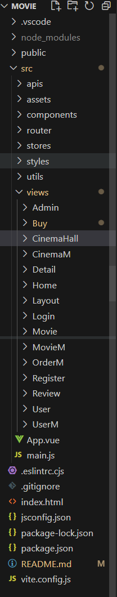

# 电影购票管理系统
技术栈：Vue3、Vite、VueRouter、Pinia、Element-Plus、Axios、less

本项目旨在开发一个集电影查询、在线选座、用户评价、后台管理等功能于一体的电影购票系统前端界面
## 功能介绍
* 用户登录：输入用户名密码点击登录进行校验，校验通过调取后端接口，调用成功，跳转首页
* 用户权限：根据登录获取到的用户信息，来获取到不同头部菜单，管理员会多一个管理按钮，点击可进入后台管理界面
* 个人订单：用户可以查看已购买的电影票
* 用户个人信息修改：用户可以修改头像，用户名，电话，密码等个人信息
* 电影搜索：输入电影名称，点击搜索可跳转到电影详细页
* 电影购买：选择影院后选择放映厅，然后进行座位选择，选择完毕后台跳转到支付页，支付成功生成订单
* 管理：管理员可对用户、影院、电影、影厅、场次进行增删改查操作，可对评论，订单进行删查操作
* 添加影台：根据已有影院，对影院进行影厅的增加
* 添加场次：根据已有的影院，对选择的影院对应的影厅，添加电影放映场次
## 项目结构/目录介绍
MOVIE
├─node_modules              依赖的第三方库和工具
├─public                    静态资源文件，如 HTML 文件和图标
├─package.json              项目依赖和脚本
├─package-lock.json         依赖版本锁定
├─vite.config.ts            Vite 配置文件
├─README.md                 项目说明文档
└─src                       源代码目录
	├─assets                静态资源，如图标和图片
	│    ├─icons             项目中使用的图标
	│    └─.........         其他图片
	│
	├─router                vue-router路由文件
	│    └─index.js          路由配置的入口文件
	│
	├─stores                Pinia状态管理文件
	│    └─index.js          状态管理文件
	│
	├─apis                  封装请求相关接口
	│    ├─cinema.js         影院相关接口
	│    ├─login.js          登录相关接口
	│    ├─movie.js          电影相关接口
	│    ├─order.js          订单相关接口
	│    ├─review.js         评论相关接口
  │    ├─screen.js         场次相关接口
  │    ├─seat.js           选座相关接口
  │    └─user.js           用户相关接口
	│
	│  
	├─styles                样式文件
	│    └─common.scss       全局样式
  │
  ├─utils                 封装Axios实例
	│    └─http.js           二次封装axios
	│  
	├─views                 应用的视图组件
	│    ├─Admin             管理员页面
	│    ├─Buy               电影购买页面
	│    ├─CinemaHall        影厅信息管理页面
	│    ├─CinemaM           影院信息管理页面
	│    └─Detail            电影详细页面
	│  
	├─App.vue               根组件
	└─main.js               应用的入口文件

